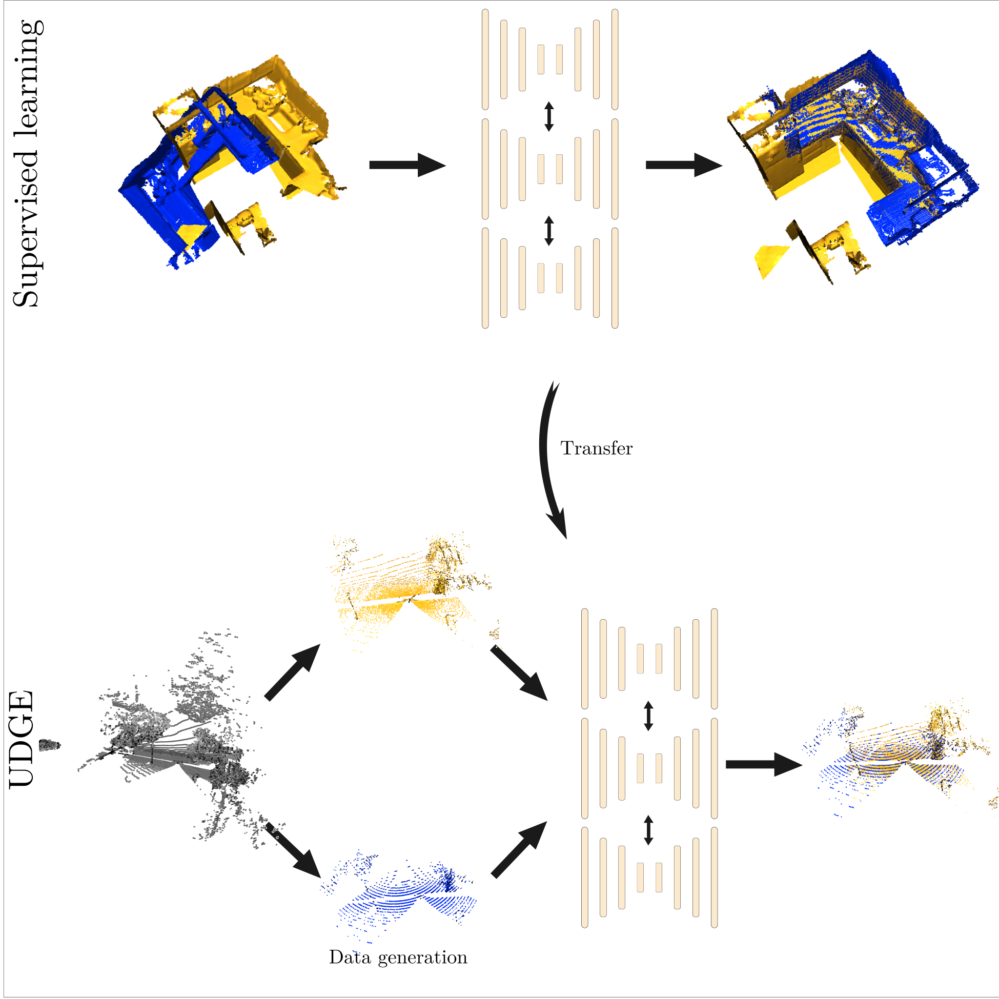

# 3D Point Cloud Registration with Multi-Scale Architecture and Unsupervised Transfer Learning

Compute features for 3D point cloud registration. The article is available on [Arxiv](https://arxiv.org/abs/2103.14533). This article has been accepted in [3DV2021](https://3dv2021.surrey.ac.uk/accepted-papers/).
 
 
 


It relies on:
- MS-SVConv : A multi scale sparse voxel architecture
- UDGE: Unsupervised transfer learning using Data GEneration
The combination of both allows better generalization capabilities and transfer across different datasets.

The code is also available on the [torch-points3d repository](https://github.com/nicolas-chaulet/torch-points3d).
This repository is to show how to launch the code for training and testing.

## Demo
If you want to try MS-SVConv without installing anything on your computer, A Google colab notebook is available [here](https://colab.research.google.com/github/humanpose1/MS-SVConv/blob/main/notebook/demo_MSSVConv.ipynb) (it takes few minutes to install everything). In the colab, we compute features using MS-SVConv and use Ransac (implementation of Open3D) to compute the transformation.
You can try on 3DMatch on ETH. With this notebook, you can directly use the pretrained model on your project !
The code have been tried on an NVDIA RTX 1080 Ti with CUDA version 10.1 and Ubuntu 18.04.


## Train and test the model using the library torch-points3d

### Installation for training and evaluation
This installation step is necessary if you want to train and evaluate MS-SVConv.


first you need, to clone the [torch-points3d repository](https://github.com/nicolas-chaulet/torch-points3d)
```
git clone https://github.com/nicolas-chaulet/torch-points3d.git
```
Torch-points3d uses [poetry](https://python-poetry.org/) to manage the packages. after installing Poetry, run :
```
poetry install --no-root
```
Activate the environnement
```
poetry shell
```
If you want to train MS-SVConv on 3DMatch, you will need pycuda (It's optional for testing and for other dataset).
```
pip install pycuda
```
You will also need to install [Minkowski Engine](https://github.com/NVIDIA/MinkowskiEngine) and [torchsparse](https://github.com/mit-han-lab/torchsparse)
Finally, you will need [TEASER++](https://github.com/MIT-SPARK/TEASER-plusplus) for testing.

If you have problems with installation (espaecially with [pytorch_geometric](https://github.com/rusty1s/pytorch_geometric)), please visit the [Troubleshooting section](https://github.com/nicolas-chaulet/torch-points3d#troubleshooting) of torch-points3d page.

## Training

### registration


If you want to train MS-SVConv with 3 heads starting at the scale 2cm, run this command:
```
poetry run python train.py task=registration models=registration/ms_svconv_base model_name=MS_SVCONV_B2cm_X2_3head data=registration/fragment3dmatch training=sparse_fragment_reg tracker_options.make_submission=True training.epochs=200 eval_frequency=10
```

automatically, the code will call the right yaml file in `conf/data/registration` for the dataset and `conf/model/registration` for the model.
If you just want to train MS-SVConv with 1 head, run this command
```
poetry run python train.py task=registration models=registration/ms_svconv_base model_name=MS_SVCONV_B2cm_X2_1head data=registration/fragment3dmatch training=sparse_fragment_reg tracker_options.make_submission=True training.epochs=200 eval_frequency=10
```
You can modify some hyperparameters directly on the command line. For example, if you want to change the learning rate of `1e-2`, you can run:
```
poetry run python train.py task=registration models=registration/ms_svconv_base model_name=MS_SVCONV_B2cm_X2_1head data=registration/fragment3dmatch training=sparse_fragment_reg tracker_options.make_submission=True training.epochs=200 eval_frequency=10 training.optim.base_lr=1e-2
```

To resume training:
```
poetry run python train.py task=registration models=registration/ms_svconv_base model_name=MS_SVCONV_B2cm_X2_3head data=registration/fragment3dmatch training=sparse_fragment_reg tracker_options.make_submission=True epochs=200 eval_frequency=10 training.checkpoint_dir=/path/of/directory/containing/pretrained/model
```


WARNING : On 3DMatch, you will need a lot of disk space because the code will download the RGBD image on 3DMatch and build the fragments from scratch. Also the code takes time (few hours).


For 3DMatch, it was supervised training because the pose is necessary. But we can also fine-tune in a self-supervised fashion (without needing the pose).

To train on Modelnet run this command:
```
poetry run python train.py task=registration models=registration/ms_svconv_base model_name=MS_SVCONV_B2cm_X2_3head data=registration/modelnet_sparse_ss training=sparse_fragment_reg tracker_options.make_submission=True training.epochs=200 eval_frequency=10
```

To fine-tune on ETH run this command (First, download the pretrained model from 3DMatch [here](https://cloud.mines-paristech.fr/index.php/s/hRc6y2YIFtYsGAI/)):
```
poetry run python train.py task=registration models=registration/ms_svconv_base model_name=MS_SVCONV_B4cm_X2_3head data=registration/eth_base training=sparse_fragment_reg_finetune tracker_options.make_submission=True training.epochs=200 eval_frequency=10 models.path_pretrained=/path/to/your/pretrained/model.pt
```
To fine-tune on TUM, run this command:
```
poetry run python train.py task=registration models=registration/ms_svconv_base model_name=MS_SVCONV_B4cm_X2_3head data=registration/testtum_ss training=sparse_fragment_reg_finetune tracker_options.make_submission=True training.epochs=200 eval_frequency=10 models.path_pretrained=/path/to/your/pretrained/model.pt
```


For all these command, it will save in `outputs` directory log of the training, it will save a `.pt` file which is the weights of

### semantic segmentation

You can also train MS-SVConv on scannet for semantic segmentation. To do this simply run:
```
poetry run python train.py task=segmentation models=segmentation/ms_svconv_base model_name=MS_SVCONV_B4cm_X2_3head lr_scheduler.params.gamma=0.9922 data=segmentation/scannet-sparse training=minkowski_scannet tracker_options.make_submission=False tracker_options.full_res=False data.process_workers=1 training.wandb.log=True eval_frequency=10 training.batch_size=4
```
And you can easily transfer from registration to segmantation, with this command:
```
poetry run python train.py task=segmentation models=segmentation/ms_svconv_base model_name=MS_SVCONV_B4cm_X2_3head lr_scheduler.params.gamma=0.9922 data=segmentation/scannet-sparse training=minkowski_scannet tracker_options.make_submission=False tracker_options.full_res=False data.process_workers=1 training.wandb.log=True eval_frequency=10 batch_size=4 models.path_pretrained=/path/to/your/pretrained/model.pt
```

## Evaluation

If you want to evaluate the models on 3DMatch,  download the model [here](https://cloud.mines-paristech.fr/index.php/s/m93S2jx91GRrduu) and run:

```
poetry run python scripts/test_registration_scripts/evaluate.py task=registration models=registration/ms_svconv_base model_name=MS_SVCONV_B2cm_X2_3head data=registration/fragment3dmatch training=sparse_fragment_reg cuda=True data.sym=True training.checkpoint_dir=/directory/of/the/models/
```
on ETH (model [here](https://cloud.mines-paristech.fr/index.php/s/pUmGPtHUG2ASxlJ)),
```
poetry run python scripts/test_registration_scripts/evaluate.py task=registration models=registration/ms_svconv_base model_name=MS_SVCONV_B4cm_X2_3head data=registration/eth_base training=sparse_fragment_reg cuda=True data.sym=True training.checkpoint_dir=/directory/of/the/models/
```
on TUM (model [here](https://cloud.mines-paristech.fr/index.php/s/LUVEZvutaDpEkVD)),
```
poetry run python scripts/test_registration_scripts/evaluate.py task=registration models=registration/ms_svconv_base model_name=MS_SVCONV_B2cm_X2_3head data=registration/testtum_ss training=sparse_fragment_reg cuda=True data.sym=True training.checkpoint_dir=/directory/of/the/models/
```
You can also visualize matches, you can run:
```
python scripts/test_registration_scripts/see_matches.py task=registration models=registration/ms_svconv_base model_name=MS_SVCONV_B4cm_X2_3head data=registration/eth_base training=sparse_fragment_reg cuda=True data.sym=True training.checkpoint_dir=/directory/of/the/models/ data.first_subsampling=0.04 +ind=548 +t=22
```

You should obtain this image
 
 
## Small Updates

With the current version of torch-points3d, we obtain a FMR of 97.4 insted of 98.4 with $\tau=0.05$ on 3DMatch in a supervised setting. However, with $\tau=0.2$, we obtain a FMR of 91.6 instead of 89.9. In other word, the new version is better in terms of FMR with $\tau=0.2$.
If you want to get the previous results, you can use the previous version.
```
git clone https://github.com/humanpose1/deeppointcloud-benchmarks.git
git checkout -b "MS_SVCONV_B2cm_X2_3head" d079374da05506762f32bb7b090f35be86a90760
```
You will have to install older versions of omegaconf, hydra, torch and torchsparse. 
the model can be downloaded [here](https://cloud.mines-paristech.fr/index.php/s/kFGIqiY9Ky5OeiB)


## Model Zoo
You can find all the pretrained model  (More will be added in the future)

## citation
If you like our work, please cite it :
```
@inproceedings{horache2021mssvconv,
author = {S. Horache and J. Deschaud and F. Goulette},
booktitle = {2021 International Conference on 3D Vision (3DV)},
title = {3D Point Cloud Registration with Multi-Scale Architecture and Unsupervised Transfer Learning},
year = {2021},
volume = {},
issn = {},
pages = {1351-1361},
doi = {10.1109/3DV53792.2021.00142},
url = {https://doi.ieeecomputersociety.org/10.1109/3DV53792.2021.00142},
publisher = {IEEE Computer Society},
address = {Los Alamitos, CA, USA},
month = {dec}
}
}
```
And if you use ETH, 3DMatch, TUM or ModelNet as dataset, please cite the respective authors.

## TODO
 - Add other pretrained models on the model zoo
 - Add others datasets such as KITTI Dataset
